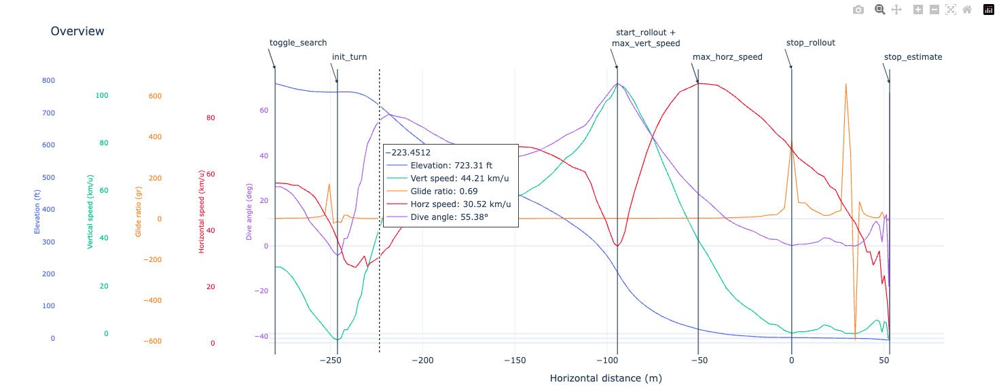
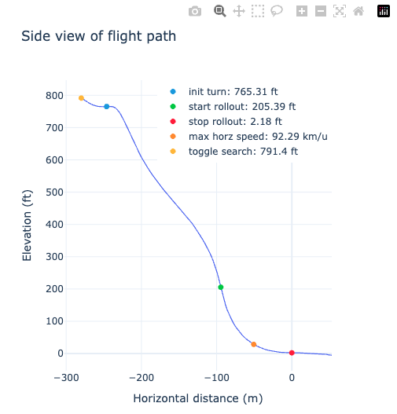

# Sw00pGenerator3000 (SG3K)

The Sw00pGenerator3000 offers a suite of visualizations designed to provide a comprehensive understanding of your skydive swoop landing. These visualizations deliver an in-depth analysis of your performance, enabling you to pinpoint areas for improvement and enhance your skills. With these tools, you can:

- **Visualize Your Flight:** See your flight trajectory overlaid on satellite imagery or in a normal plot, giving you a real-world perspective on your flight.
- **Analyze Key Metrics:** Examine critical metrics such as elevation, horizontal speed, vertical speed, dive angle, and glide ratio, all in one line for clarity.
- **Identify Key Events:** Key events like the start of toggle search, init_turn, start of rollout, max horizontal speed, and stop rollout are clearly marked for detailed analysis.
- **Interactive Exploration:** Use interactive features to zoom in on specific sections of your flight path for a more granular examination.

These visualizations are more than just graphs; they are tools to help you understand the dynamics of your skydive and to refine your technique for future jumps. Enjoy the journey of discovery and improvement with Sw00pGenerator3000!

## Requirements

To successfully use the Sw00pGenerator3000, you'll need the following:

- **Make**: A build automation tool to manage the build process.
- **Docker**: A platform for developing, shipping, and running applications in containers.
- **Mapbox token**: An access token for using Mapbox services, required for some of the visualization features.

## Steps to Get Started 

1. Clone this repository
2. Execute **'make copy'** or **'make c'** to generate an **.env** file
3. Enter your Mapbox token in the **.env** file
4. Run **'make docker-compose-up'** or **'make dc'**
5. Navigate to http://localhost:8888/lab/tree/notebooks/sg3k_pro.ipynb and follow the instructions in the notebook

## Flight Analysis Metrics

The Sw00pGenerator3000 provides a comprehensive set of metrics to help you refine your swooping skills. Below are the key performance indicators for your recent flight:

```
Flight Data
===========
exited airplane:          7175.0 ft AGL

Sw00p Data
==========
toggle search:            897.5 ft AGL, 170.1 m back, -98.1 m offset
initiated turn:           849.8 ft AGL, 123.9 m back, -82.4 m offset
max vertical speed:       286.2 ft AGL, 20.7 m back, -85.9 m offset (103.1 km/u)
started rollout:          267.5 ft AGL, 19.5 m back, -85.4 m offset (102.7 km/u)
finished rollout:         87.2 ft AGL, 0.0 m back, 0.0 m offset
max horizontal speed:     119.2 ft AGL, 11.0 m back, -46.6 m offset (87.8 km/u)

degrees of rotation:      272 deg (left-hand)
time to execute turn:     14.2 sec
time during rollout:      4.4 sec
time aloft during swoop:  9.8 sec

entry gate speed:         66.8 km/u
distance to stop:         108.36 m

Landing Pattern
===============
downwind to base:         233.4 m, 2.57 gr
base to pom:              204.01 m, 2.82 gr
downwind to pom:          437.41 m, 2.69 gr
```

## Visualizations

The Sw00pGenerator3000 provides a range of visualizations to help you gain a deeper understanding of your flight. These visualizations offer a detailed breakdown of your performance, allowing you to identify areas for improvement and refine your skills.

### Overview

This visualization offers a comprehensive overview of your skydive swoop landing, providing valuable insights into your maneuver:
- **Metrics:** The plot displays **elevation, horizontal speed, vertical speed, dive angle, and glide ratio** all in one line, giving you a clear and concise view of your flight dynamics.
- **Event Markers:** Key events like the start of toggle search, init_turn, start of rollout, max horizontal speed, and stop rollout are clearly marked for detailed analysis.



### Horizontal Speed

Understand the dynamics of your skydive swoop landing with our horizontal speed plot. Here’s what you’re observing:

- **Speed Profile:** The plot illustrates your horizontal speed, giving you a clear picture of your velocity changes.
- **Performance Insights:** Identify areas where you can improve your speed and agility by analyzing the speed variations throughout the flight.


### Side View Of Flight Path

Examine the nuances of your skydive swoop landing with our side view plot visualization. Here’s what you’re looking at:
- **Flight Path Profile:** A profile view of your flight path, offering a clear observation of the landing’s rollout.
- **Rollout Details:** This perspective reveals the steepness of your descent and your proximity to the gate during the approach.
- **Maneuver Altitude:** Gain insight into the altitude at which you initiated your maneuver, providing valuable information for performance analysis.
- **Event Markers:** Key events are marked along your flight path.



### Overhead View Of Flight Path

Gain a unique perspective on your skydive swoop landing with our normal plot visualization. Here’s what you’re seeing:
- **Flight Trajectory:** Your flight path is plotted, giving you a bird’s-eye view of your skydive.
- **Event Markers:** Key events are marked along your flight path.


### 2D Map

Explore the intricacies of your skydive swoop landing with our detailed 2D map visualization. Here’s what you’re looking at:
- **Flight Path:** Your flight trajectory is clearly marked on the map, giving you a top-down view of your skydive.
- **Event Markers:** Key events are marked along your flight path.


### 3D Map

Dive into the details of your skydive swoop landing with our immersive 3D map visualization. Here’s what you’re seeing:
- **Flight Path:** Your flight trajectory is vividly overlaid on high-resolution satellite imagery, providing a real-world context to your skydive.
- **Altitude Representation:** The altitude changes during your swoop are represented in 3D, giving you a clear view of your descent and landing approach.
- **Interactive Exploration:** Rotate, zoom, and pan the map to explore your flight from different angles and perspectives.
- **Event Markers:** Key events are marked along your flight path.

